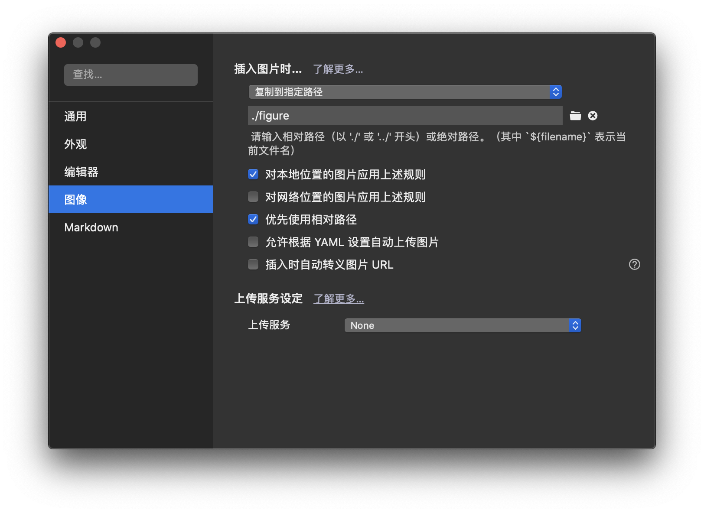

# Rosetta常见问题FAQ

关于本手册如果有任何问题可以在群里@杨子辰-北电科，我都会解答的
## 使用方法

请配合Typora等MarkDown阅读软件索引或搜索你遇到的问题
如果在此找不到你想要的答案方可在群里进行提问！！！
作为回报，提问者得到答案后有义务添加一个条目。
如果你在FAQ文档中需要使用图片时,请按照下图所示的设置把图片添加到图库文件中(图库文件的路径用**相对路径**描述)

