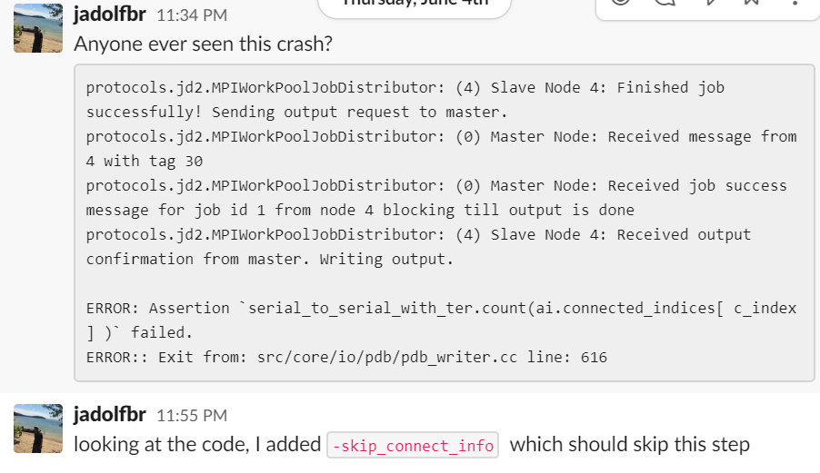

# 常见问题FAQ


## 1. **Rosetta无法正确读入PDB结构**

当PDB文件occupy一列为0，Rosetta默认会忽略该氨基酸，可以通过添加```-ignore_zero_occupancy false```参数强制程序读入，occupy列后面的一列B-factor对Rosetta使用可以认为没有影响。

当PDB中存在为定义残基，早期版本Rosetta可通过添加```-ignore_unrecognized_res```参数忽略，新版本的Rosetta会根据其原子连接自动进行参数化，残基名添加“pdb_”。

## **2. Minimizer 出现[ ERROR ] Inaccurate G! 提示**

没事儿。
Rosetta的能量函数在优化到局部极小时由于导数不连续等因素可能会出现计算Hessian矩阵失败等数值问题。但Rosetta整体优化流程基于随机（Monte Carlo）转动+最优化，在个别局部最优出现错误不影响整体结果。

## **3. 报错serial_to_serial_with_ter...**



